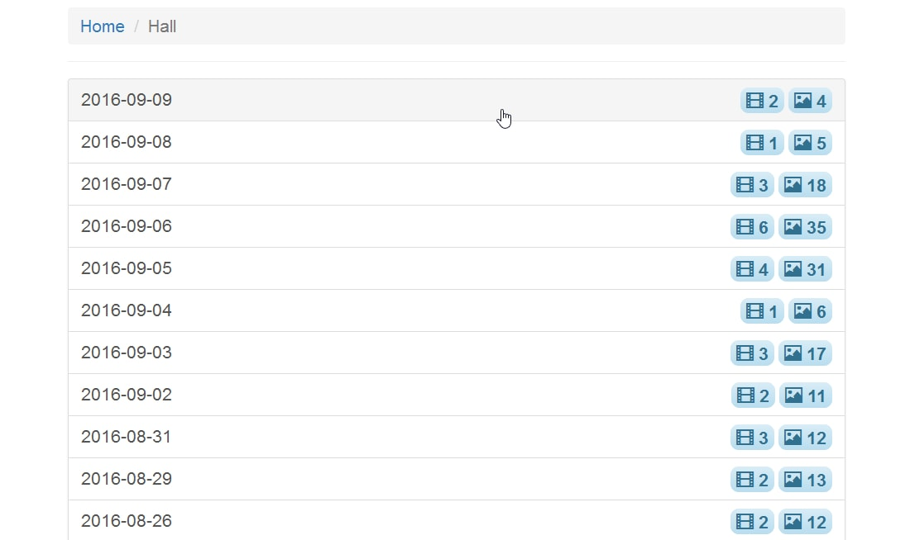
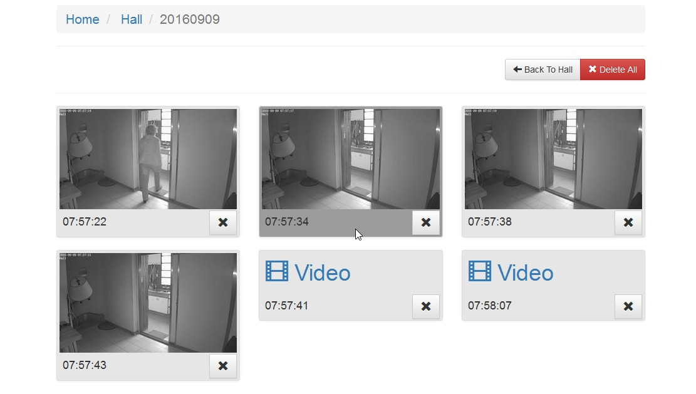
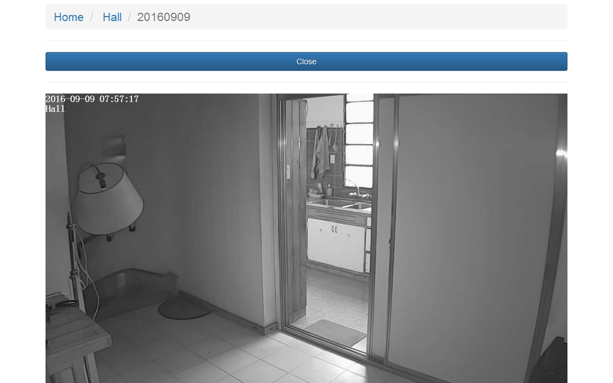

# Snapshot Explorer

This is a very simple web app that help the user to browse among snapshots images and videos created
by a webcam on **movement detection**.

## Feature list

It provides following features :
- [x] basic HTTP Authentication
- [x] view images(jpg) and video(mkv) created by the webcam on movement detection
- [x] navigate by date folders
- [x] add support to time zone
- [x] manual delete selected image and video
- [x] manual delete image and video per date
- [x] responsive design

## Screenshots

Here is how the current webapp looks like.

- date folder view



- gallery view



- image view



## Configuration

The configuration is defined into the file `config.php` located at the root of the project. It is actually a PHP script that defines the **$config** array which is then used by other components.

Below is a commented configuration file :

```php
<?php

$config = [
  // this is the base folder where images/video files are saved
  'baseFolder' => __DIR__ . '/explorer',

  // This is the base URL used to preview images/vdeo files
  'baseUrl'    => 'http://localhost/dev/cam-browser/explorer',

  // name of the folder where images/video are located. It must be relative
  // to the base folder parameter configured above.
  'folderImg'   => "snapshots",
  'folderVideo' => "video",

  // file pattern to search for in the folder
  'imageFilePattern' => "*.jpg",
  'videoFilePattern' => "*.mkv",

  // timezone adjustment applied to the file last modification date
  // timezone support in php : http://php.net/manual/fr/timezones.php
  'timezone' => "Pacific/Chatham"
];
```
